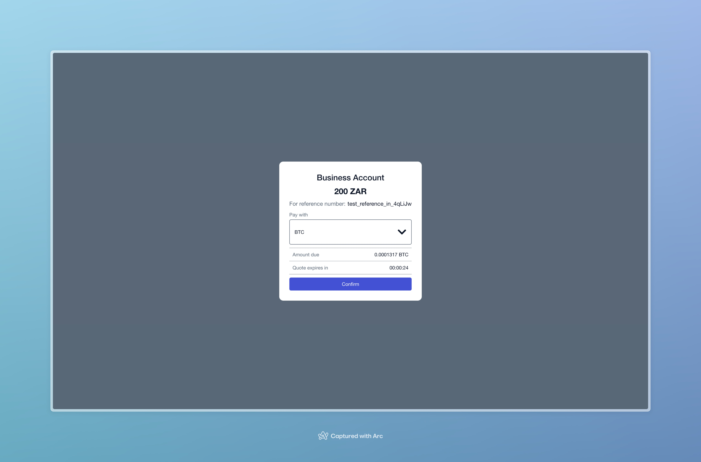

# BVNK HPP



## Pre-requisites

The project makes use of a .env file, please see `/src/types/environment.d.ts` for expected values.

> By default, the app will run on port 3000 but we explicitely do so by setting PORT in .env appropriately. Please do the same.

## How to

In your project root, please run:
```bash
yarn install 
```
or
```bash
npm install
```

Then
```bash
yarn start
```